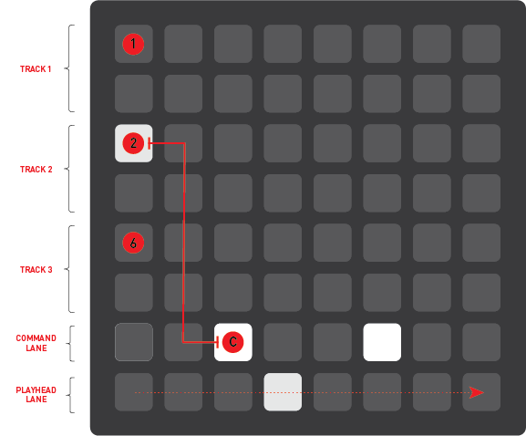

# euclidean-grid
euclidean rhythm sequencer for the monome grid, built in max

download the max patch here: [euclidean_grid](euclidean_grid.maxpat)

created by: [jonathan snyder](https://github.com/jaseknighter)

## What is a euclidean rhythm?
A euclidean rhythm evenly spreads the notes within a sequence of steps. It was first described by Godfried Toussaint in a 2005 paper [The Euclidean Algorithm Generates Traditional Musical Rhythms](http://cgm.cs.mcgill.ca/~godfried/publications/banff.pdf).

## Requirements 
- Grid (Developed on a 128 neotrellis DIY grid, but should be usable with any Grid (64/128/256))
- Max

## Instructions for the monome grid

### Overview

The euclidean grid is composed of three basic elements:

- tracks
- the command lane
- the playhead lane

#### Tracks
There are three tracks, each comprised of 16 buttons. Buttons that are part of a selected rhythm are lit. Buttons in each track also light up as the playhead passes through them.

#### Command lane
The command lane contains five control buttons: 

- **A** sets the total number of steps within each sequence
- **B** sets the number of notes to be spread across the sequence
- **C** stops/starts/resets the sequence
- **D** sets the rotation of the sequence (i.e., the step in which the sequence begins)
- **E** resets the sequence (when pressed in combination with button **C**)

#### Playhead lane
The playhead lane shows the position of the global playhead. 

### Starting and stopping

#### Start/stop all tracks

To stop or start all tracks, press or release buttons ***A*** and ***C*** at the same time.

#### Start/stop a single track

To start or stop a single track, simultaneously press or release button ***C*** along with the first button of the track you wish to start or stop (button ***1***, ***2***, or ***3***)

#### Set the number of steps

To set the number of steps in a sequence, simultaneously press or release button ***A*** along with the button that corresponds to the number of total steps you wish to set for the track. For example:

- Simultaneously press or release buttons ***A*** and ***5*** to set Track 2 to 16 steps
- Simultaneously press or release buttons ***A*** and ***3*** to set Track 2 to 4 steps
- Simultaneously press or release buttons ***A*** and ***4*** to set Track 2 to 9 steps

#### Set the number of notes

To set the number of notes in a sequence, simultaneously press or release button ***B*** along with the button that corresponds to the number of total notes you wish to set for the track. For example:

- Simultaneously press or release buttons ***B*** and ***3*** to set Track 2 to 4 notes
- Simultaneously press or release buttons ***B*** and ***4*** to set Track 2 to 10 notes
- Simultaneously press or release buttons ***B*** and ***5*** to set Track 2 to 16 notes

#### Set the rotation

To set the rotation (when the first note begins in a sequence), simultaneously press or release button  ***D***  along with along with the button that corresponds to the step in the track where you wish the first note to begin. This will shift all notes in the sequence by the number selected. For example:

- Simultaneously press or release buttons ***D*** and ***3*** to set Track 2 to begin at the fourth step of its sequence.

#### Sync all tracks to the master playhead

To sync all tracks to the playhead, simultaneously press or release buttons  ***D*** and ***E***. 

## Instructions for the max patch

The presentation view of the [euclidean grid max patch](euclidean_grid_8x8.maxpat) provides the following controls:

- grid ***device***: select the grid device to be used in the patch 
- external ***clock source*** (optional): select an external clock source for the patch
- ***midi out***: select where to send the midi notes
- ***bpm***: select the beats per minute
- ***start/stop all***: start/stop all tracks
- ***start/stop 1***: start/stop track 1
- ***start/stop 2***: start/stop track 2
- ***start/stop 3***: start/stop track 3
- ***reset counters***: sync all tracks to the master playhead
- ***reset track notes***: set all notes for each track to the note selected 
- sliders: set the notes for each track (sliders of active notes are colored light blue) 

## Ideas for future enhancements ##
General
- Chaining, accenting, and masking
- Set BPM from the grid
- Set midi channel from the grid
- Implement for other platforms (Pure Data, SuperCollider, etc.)

MAX
- Ableton Link integration
- Replace custom metering with Max’s build-in transport object

## Credits
- monome: [grid studies](https://monome.org/docs/grid/studies/max/)
- okyeron: [neotrellis monome compatible grid](https://github.com/okyeron/neotrellis-monome)
- Raja: [Raja'sLilMonomaxTutorial](https://llllllll.co/t/grid-led-row-grid-led-col-grid-led-map-confused/1940/10)
- 11olsen: [Euclidean algorithm patch](http://www.11olsen.de/code/max-objects/11euclidean)
- Source Audio: [Midi clock](https://cycling74.com/forums/slave-max-to-elektron-midi-clock)
- RKNLA: [BPM calculator](https://cycling74.com/forums/how-can-i-take-the-bpm-from-'bang')
